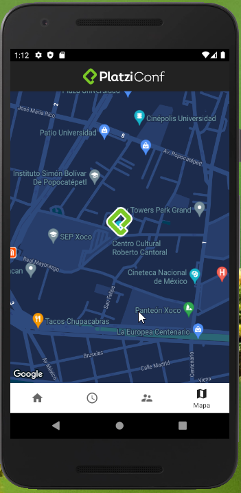

- Descargar android studio: https://developer.android.com/studio
- Habilitar servicio de mapa: https://console.cloud.google.com/
- Habilitar base de datos firestore: https://console.firebase.google.com/
- Cambiar diseño de mapa: https://mapstyle.withgoogle.com/ (el json de diseño va en res/raw)

-------------------------

------------------------

